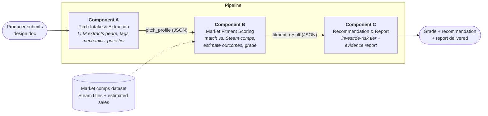

# Project Proposal — GreenlightIQ: An Automated Game-Pitch Fitment Reviewer

**Author:** Fred Teumer 
**Course:** JHU AI Engineering — Cloud-Based System Design Individual Project 
**Date:** July 16, 2026

---

## 1. Title & Brief Description of Use Case

**GreenlightIQ** is a decision-support system for a video game **publisher's acquisitions team**. When an independent studio pitches a new title, a producer receives a written **game design document (GDD)** and has to answer a hard question quickly: *is this pitch worth funding, and how much risk are we taking on?*

GreenlightIQ automates the first-pass evaluation. A user (the producer/developer) submits a design doc; the system extracts the game's defining attributes (genre, tags, mechanics, price tier), benchmarks those attributes against a market dataset of previously released Steam titles, and returns a **letter grade**, an **investment / de-risk recommendation**, and a **supporting report** of comparable games that succeeded or failed in the same niche. It turns an ad-hoc, gut-feel screening into a repeatable, evidence-backed one.

## 2. Problem Statement & Business Value

**Problem.** Over 19,000 video games were released on Steam in 2025 with this number expected to increase in 2026. Game publishers receive far more pitches than they can fund, and early greenlight decisions are made under uncertainty. Producers rely on intuition and scattered manual research: pulling up a few comparable titles, eyeballing their reception, and guessing at market saturation. This is slow, inconsistent between reviewers, and prone to two expensive failure modes: **funding a title in an oversaturated niche** (money lost to a crowded market) and **passing on a title that fit a proven, underserved niche** (opportunity lost to a competitor).

**Business value.** GreenlightIQ gives the publisher teams a fast, consistent, and defensible first screen:

- **Speed** — reduces initial pitch triage from hours of manual comp-hunting to seconds.
- **Consistency** — every pitch is scored against the same market data and the same rubric, removing reviewer-to-reviewer variance.
- **Risk framing** — the output is expressed in the publisher's own language: how much to invest and how to de-risk, backed by comparable-title evidence.
- **Auditability** — each recommendation ships with the comps and assumptions behind it, so a greenlight (or a pass) can be justified to leadership.

This is explicitly a *first-pass triage / decision-support* tool, not an autonomous funding authority — a human still owns the final call.

## 3. Overview of the Three Components

The system is composed of three independently developed components, each with a distinct role in the pipeline.

### Component A — Pitch Intake & Extraction Service
Accepts the submitted design document (plain text / Markdown for the MVP) and uses a hosted LLM to extract a normalized, structured **pitch profile**: primary genre, sub-genres, descriptive tags, core mechanics, art style, intended price tier, and target platform. Its job is to convert unstructured prose into a clean, machine-comparable record. **Output:** a validated `pitch_profile` JSON object.

### Component B — Market Fitment Scoring Engine
Consumes the `pitch_profile` and evaluates it against a **static market comparables dataset** of released Steam titles (see [Section 5](#5-initial-thoughts-on-implementation-stacks) for sourcing and the sales-estimation approach). It selects a comparable set of games sharing the pitch's genre/tags, computes niche-level statistics (estimated sales distribution, hit rate, market saturation, price alignment), and produces a weighted **fitment score** mapped to a letter grade. **Output:** a `fitment_result` object containing the score, grade, sub-scores, and the matched comparable set.

### Component C — Recommendation & Report Generator
Consumes the `fitment_result` and translates the numeric score into the publisher's decision framework: an **investment tier** (e.g., *Greenlight / Conditional / De-risk / Pass*) with a suggested funding posture, plus a human-readable **report** listing the top comparable successes and failures, the score breakdown, and the disclosed assumptions. It then **notifies the user** by writing the report to an output location (and printing a summary). **Output:** a Markdown/HTML report + a concise decision summary.

## 4. Interaction Workflow Description

The components form a linear ingest → enrich → decide pipeline, each consuming the previous component's structured output:

1. **Component A (initial task — ingest & extract):** The producer submits a design doc. A parses it and emits a structured `pitch_profile` (genre, tags, mechanics, price tier).
2. **Component B (transition — process & score):** B receives the `pitch_profile`, matches it against the market dataset, estimates outcomes for the comparable niche, and computes a `fitment_result` (grade + sub-scores + comps).
3. **Component C (completion — decide, report, notify):** C receives the `fitment_result`, maps it to an investment/de-risk recommendation, renders the supporting report, and delivers it to the user.

## 5. Initial Thoughts on Implementation Stacks

**Language & orchestration.** Python, with each component as a separately invocable module/service exchanging JSON, so the three parts stay genuinely decoupled and independently testable.

**Component A (extraction).** A hosted LLM (e.g., Anthropic's Claude) for structured attribute extraction from the design doc, with schema-validated JSON output — reusing the structured-output patterns from earlier modules.

**Component B (scoring).** `pandas` over a **static, pre-collected market dataset**. The MVP scoring is **rule-based and deterministic** (tag-cluster matching + weighted sub-scores), which keeps it transparent and re-gradable.

**Data source & sales-estimation approach (key assumption).** The comparables dataset will be sourced from a **publicly available Steam dataset (Kaggle, SteamSpy, or a similar source)** containing genre, tags, price, release date, and review counts. **Steam does not publish actual unit-sales figures**, so GreenlightIQ estimates sales from public proxies:

- **Review-count method (Boxleiter):** estimated units ~ review count * an era-adjusted multiplier; and/or
- **SteamSpy owner-range estimates** where available.

These estimates are **disclosed as assumptions** in every report — the tool benchmarks *relative* market fitment, not audited revenue. This proxy is a deliberate scope decision: it keeps the system fully offline, deterministic, and reproducible for grading, and avoids brittle live-scraping.

**Component C (report).** Plain Markdown/HTML rendering with a small comps table; delivery via file output plus a console summary for the MVP.

**Interface.** A command-line entry point for the MVP (submit a doc, get a report). A thin web/API layer is a possible enhancement but is out of MVP scope.

### Scope guardrails & stretch goals
To keep the project right-sized, the **MVP core deliverable** is the three-component pipeline above with rule-based scoring over a static dataset. Explicitly **out of scope for the MVP** (candidate stretch goals): live data scraping, a hosted web front-end, and replacing the rule-based scorer with a fully **agentic "acquisitions analyst"** that autonomously writes an investment memo. Noting these signals the growth path without expanding the committed work.
