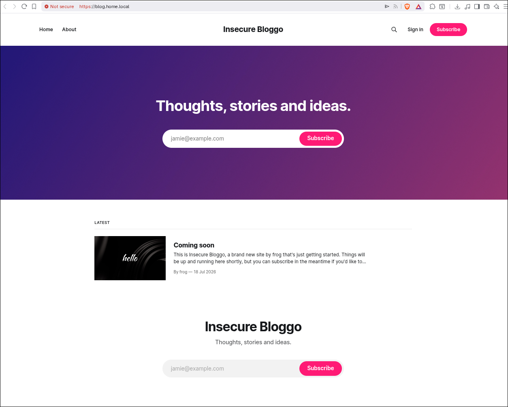
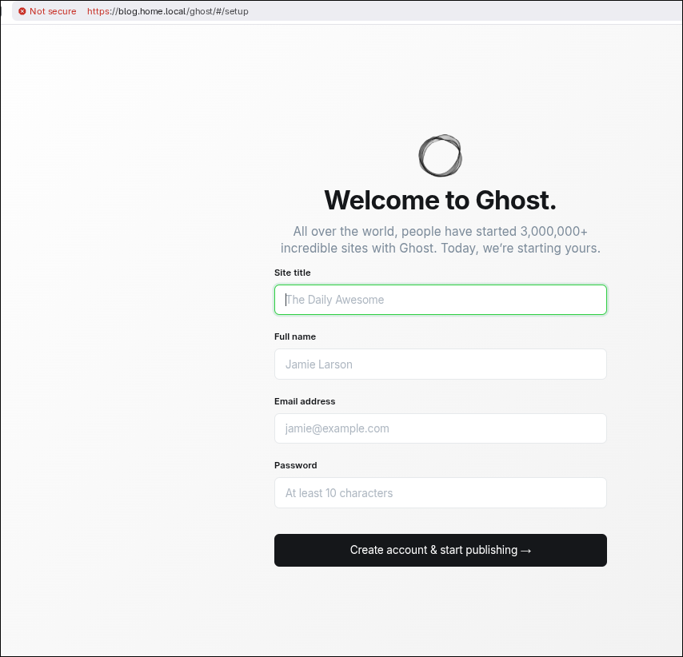
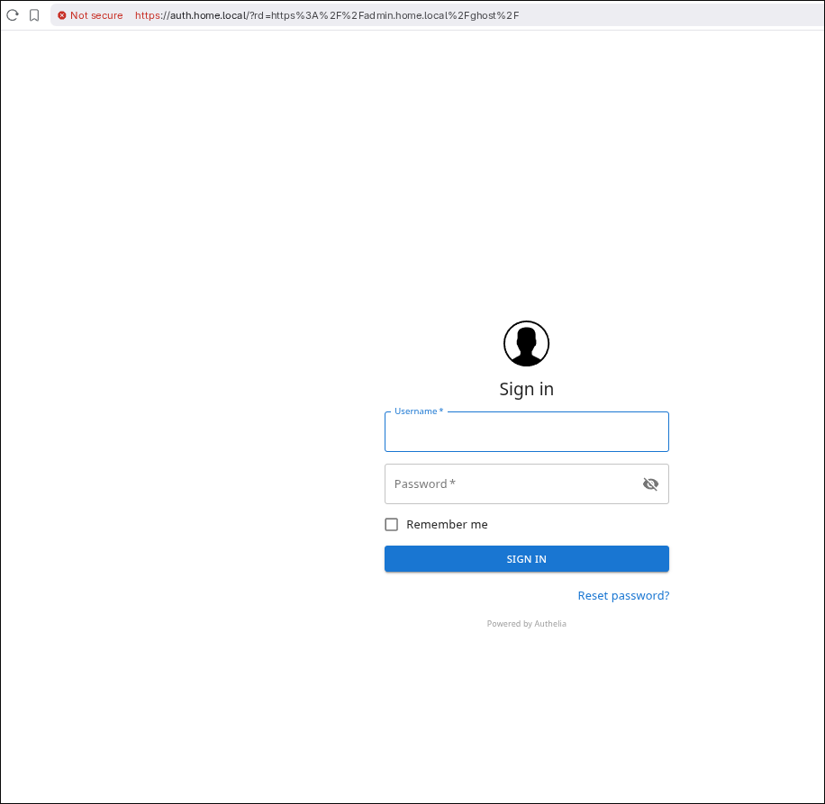
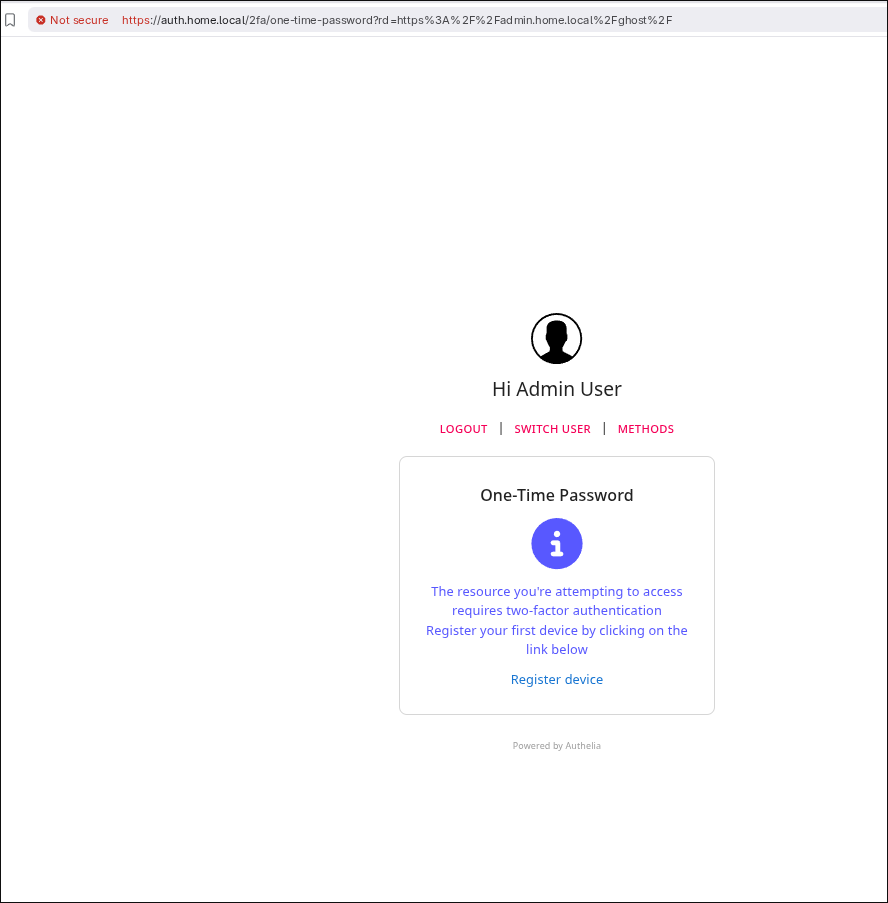
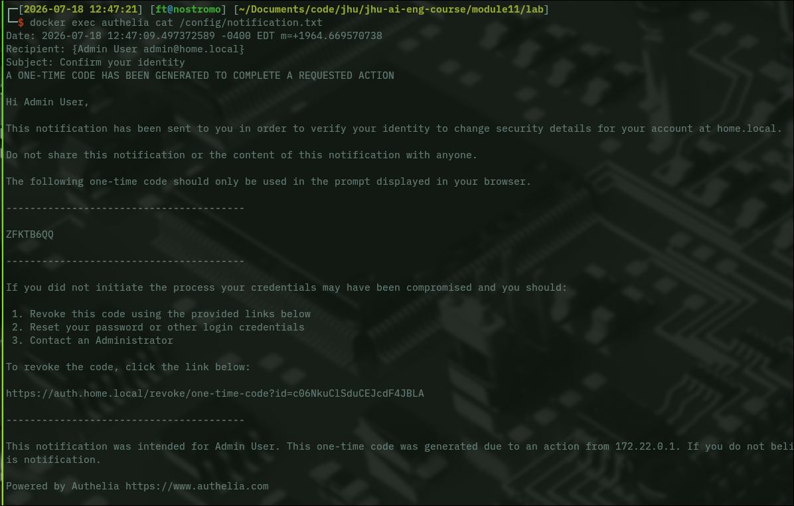
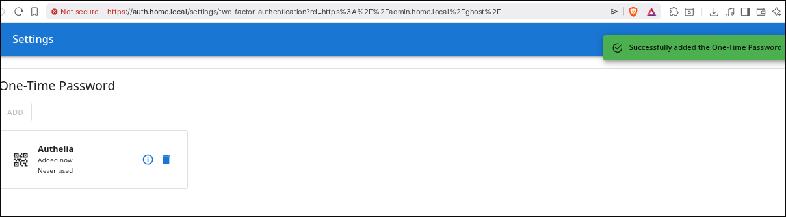
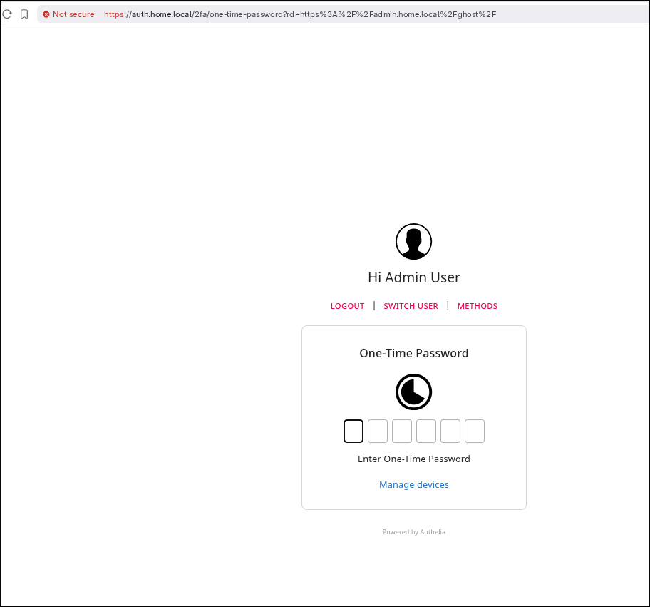
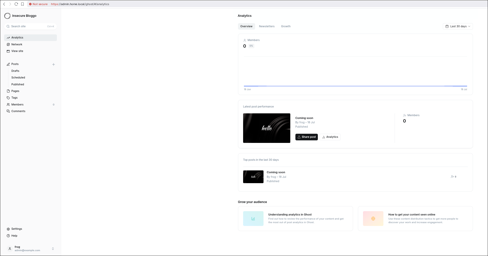
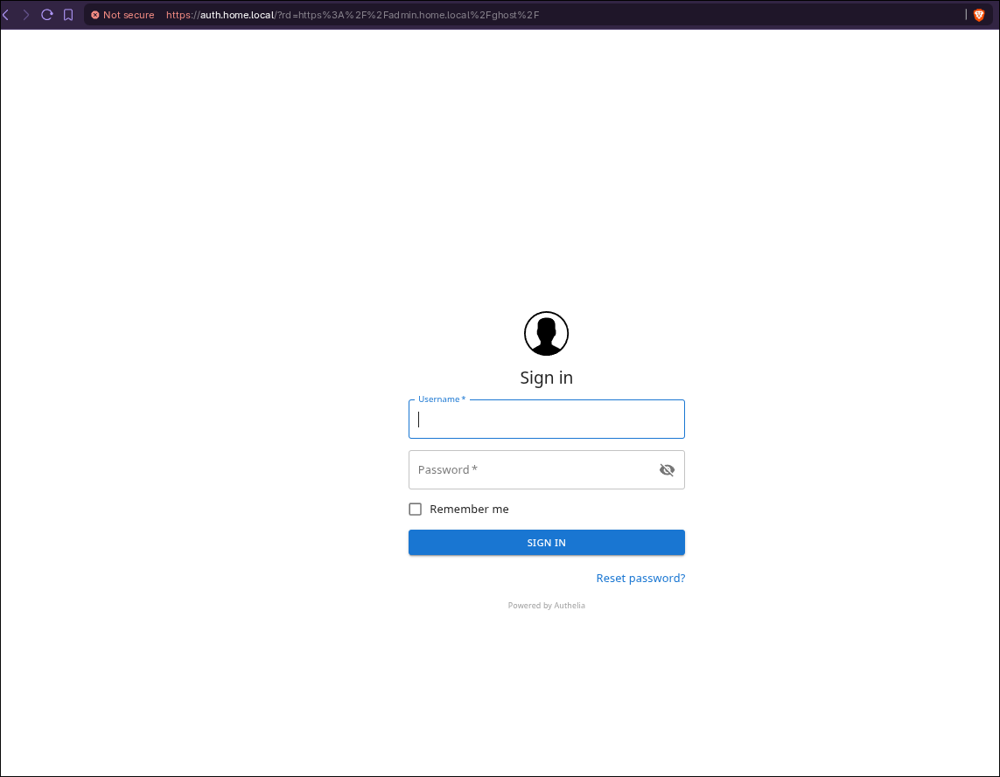
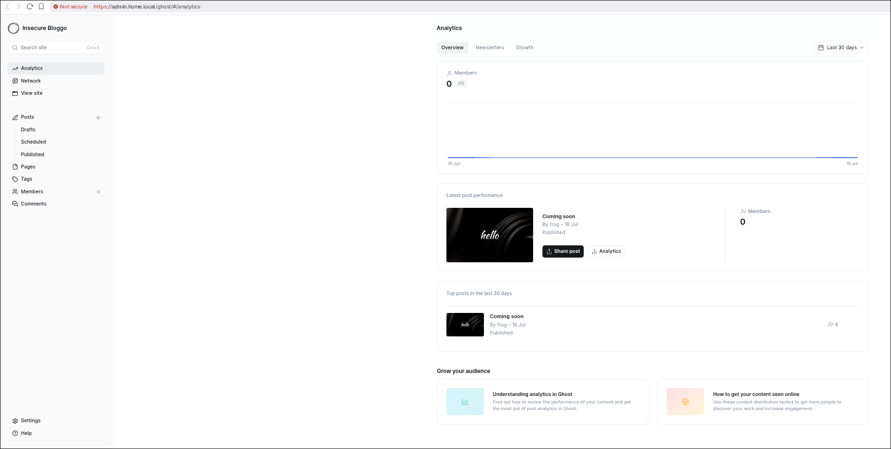

# Identity Management and Zero Trust

Fred Teumer — JHU WebSec — Module 11

## 1. Environment Summary

The lab stack runs as four containers on a single user-defined Docker bridge network (`proxy-tier`): Nginx Proxy Manager as the reverse proxy and TLS terminator, Authelia as the identity layer, Ghost as the containerized web application, and MySQL as Ghost's datastore. Only the proxy publishes ports to the host (`80`, `81`, `443`); Ghost and Authelia expose their ports only inside the Docker network, which makes the reverse proxy the single ingress path to the application. Three hostnames are served over TLS using self-signed RSA-2048 certificates — `blog.home.local` (public content), `admin.home.local` (administrative access), and `auth.home.local` (the Authelia portal) — each with Force SSL, HTTP/2, and HSTS enabled at the proxy. Multi-factor authentication is provided by Authelia using TOTP, with credentials stored in a local file backend and passwords hashed with argon2id. Before the identity-aware controls were applied, Ghost's administrative interface at `/ghost` was reachable directly through the public blog hostname, meaning the CMS admin panel was served to any unauthenticated visitor who requested that path.

## 2. Initial Exposure and Trust Assumptions

The protected asset is Ghost's administrative interface — the `/ghost` route, which grants full authoring, configuration, and user-management control over the CMS. In the initial configuration, `blog.home.local` was published as a single proxy host forwarding all paths to the Ghost container, so `https://blog.home.local/ghost` returned the admin interface without any authentication challenge. In this lab the exposure was more severe than a visible login form: because Ghost had not yet been initialized, that URL served the unclaimed first-run setup wizard, meaning the first visitor to reach it could claim ownership of the CMS outright, with no credential to guess or steal (Figure 2). The implicit trust assumption was that reaching the application over the network implied authorization to use any of its routes — the blog and its administrative backend occupied a single trust zone distinguished only by URL path. That assumption is precisely what Zero Trust rejects: network reachability is not identity, and a path that happens to be less advertised is not a control. Because policy was applied per-host rather than per-route, the administrative surface inherited the public posture of the content it shared a hostname with.

## 3. Identity and Access Design

The design places the reverse proxy in front of every request and delegates the access decision to Authelia, so no request reaches Ghost without first traversing a policy decision point. Authelia is configured with `default_policy: 'deny'` and an explicit rule set: `auth.home.local` and `blog.home.local` are `bypass` (public content must remain reachable), while `admin.home.local` requires `two_factor`. Enforcement happens through nginx's `auth_request` directive — the `admin.home.local` vhost issues an internal subrequest to Authelia's verify endpoint for every incoming request, and Authelia answers with the policy outcome. When Authelia returns `401`, an `error_page 401 =302` rule redirects the browser to the Authelia portal, appending the originally requested URL as an `rd=` parameter so the user is returned to their destination after authenticating. Authentication itself is two-staged: a username and password validated against a local file backend with argon2id hashing, followed by a TOTP one-time code from a registered device. Route protection for the exposed admin path is handled separately by `ghostBlock.config` on the public blog vhost, which returns `301` for `/ghost` and `/ghost/` to the equivalent path on `admin.home.local` — the route is not blocked, it is relocated behind the enforcement point. That configuration deliberately preserves `location ^~ /ghost/api/` as a direct proxy pass, because the blog's frontend depends on that content API for search and membership features; policy is therefore applied per-route rather than per-host, which is the distinction the original design lacked. One privilege distinction is worth noting explicitly: Authelia and Ghost maintain entirely separate identity stores with no federation between them, so passing Authelia's two-factor challenge grants *reachability* of the admin route, after which Ghost independently authenticates the user against its own credentials.

## 4. Evidence and Observed Behavior



**Figure 1.** The public blog served over HTTPS at `blog.home.local` with no authentication challenge. Confirms the `bypass` policy works as intended: adding identity controls did not make public content private.



**Figure 2.** Ghost's unclaimed setup wizard reachable at `https://blog.home.local/ghost/#/setup` before `ghostBlock.config` was applied. This is the exposure in its most severe form — not a login prompt, but an open offer of CMS ownership to any unauthenticated visitor.

**Figure 3.** Route status codes before and after the restriction, captured with `curl`:

| Route | Before | After |
| :--- | :--- | :--- |
| `blog.home.local/` | `200` | `200` (unchanged) |
| `blog.home.local/ghost` | `200` | `301` → `admin.home.local` |
| `blog.home.local/ghost/` | `200` — admin panel served | `301` → `admin.home.local` |
| `blog.home.local/ghost/api/` | — | `404` from Ghost (proxied) |
| `admin.home.local/` | `301` → `/ghost/` | `301` → `/ghost/` |
| `admin.home.local/ghost/` | `302` → auth portal | `302` → auth portal |

The administrative path changes from `200` to `301`, while public content is unaffected. The `404` on `/ghost/api/` is returned by Ghost rather than the proxy, confirming the content-API carve-out still proxies through rather than redirecting.



**Figure 4.** Requesting `admin.home.local/ghost/` without a session yields the Authelia sign-in portal rather than Ghost. The `rd=` parameter in the address bar shows the original destination being preserved for post-authentication return.



**Figure 5.** Authelia reporting that the requested resource requires two-factor authentication and that no device is yet registered. This is the authorization decision surfacing to the user: first-factor success alone does not satisfy the `two_factor` policy on this route.



**Figure 6.** Authelia's notification record for the one-time code, retrieved via `docker exec authelia cat /config/notification.txt`. Beyond delivering the code, it records the originating IP (`172.22.0.1`), the account it was issued to, and a revocation link — accounting and containment, not merely authentication.



**Figure 7.** Confirmation that the TOTP credential was enrolled. The credential reads *"Never used"*, distinguishing enrollment from exercise.



**Figure 8.** The TOTP challenge presented on the way to `admin.home.local/ghost/`, with the `rd=` destination still intact. This is the second factor being exercised, not merely registered.



**Figure 9.** Ghost's administrative dashboard at `admin.home.local/ghost/#/analytics` after completing both Authelia's two-factor challenge and Ghost's own login. Successful access to the intended route through the full control chain.

**Figure 10.** The complete post-restriction chain for a request to the formerly exposed URL:

```
$ curl -skIL https://blog.home.local/ghost

HTTP/2 301
location: https://admin.home.local/ghost/
HTTP/2 302
location: https://auth.home.local/?rd=https://admin.home.local/ghost/
HTTP/2 200

final: https://auth.home.local/?rd=https://admin.home.local/ghost/
```

The request is handed from the public host to the protected host to the identity layer, with the original destination carried through both hops.

Figures 11 and 12 show the same request to `blog.home.local/ghost` after the restriction; the only variable is whether the client presents an established identity.



**Figure 11 — denied.** Requested from a private browser window with no session. The address bar shows the request carried to `auth.home.local/?rd=https%3A%2F%2Fadmin.home.local%2Fghost%2F` — relocated to the protected host, then handed to the identity layer, with the original destination preserved for return.



**Figure 12 — allowed.** The identical URL requested from a session that had already satisfied both Authelia's two-factor challenge and Ghost's login. The address bar shows `admin.home.local/ghost/#/analytics`: the redirect still occurred, but no challenge was raised because the identity requirement was already met.

Read together, Figures 11 and 12 show that the control discriminates on **identity**, not on path. The routing behavior is identical in both cases, and only the presence of a verified session determines whether the user is challenged or admitted. A path-based block would have produced the same result for both clients.

## 5. AAA and CI4A Analysis

**Authentication** improved from absent to two-factor on the administrative path: the admin route previously required no credential at all, and now requires a password verified against an argon2id hash plus a TOTP code from an enrolled device. **Authorization** moved from implicit to explicit — Authelia's `default_policy: 'deny'` means a domain not named in the rule set is refused rather than permitted, inverting the original posture where anything reachable was allowed. **Accounting** improved but remains partial: the proxy logs every request with its authorization outcome and Authelia records identity events with source IP and revocation links (Figure 6), yet these logs are per-component, are not aggregated, and Ghost's own application-level actions are not correlated with the Authelia identity that was used to reach them, so an audit cannot fully reconstruct who did what inside the CMS. **Confidentiality** is served by TLS on all three hostnames with Force SSL and HSTS preventing downgrade to cleartext, though the certificates are self-signed, so traffic is encrypted without any third-party assurance of server identity — encryption without trust anchoring. **Integrity** benefits from HSTS and HTTP/2 at the transport layer, but the design weakens integrity of request metadata: the admin vhost rewrites both `Host` and `Origin` to `blog.home.local` before proxying, so Ghost receives deliberately falsified information about how it was reached and cannot make its own trust decisions from those headers. **Accountability and Assurance** are the weakest legs — access is tied to a single named `admin` account with no role separation, there is no device posture assessment, and authorization is evaluated once at request time rather than continuously, so a session that was legitimate when established remains valid regardless of any change in the client's state.

## 6. Residual Risk and Improvement

**Risk 1 — the forward-auth pattern returns a redirect to API requests, so session expiry fails silently.** After the Authelia session lapsed, Ghost's admin interface submitted credentials as an XHR to `/ghost/api/admin/session`; Authelia correctly returned `401`, but `error_page 401 =302` converted that denial into a redirect to an HTML login page. The single-page application cannot follow a login redirect, so it displayed only "There was a problem on the server" and retried once per second indefinitely — behavior confirmed in the proxy access logs, where the `302` on the admin host and the corresponding CORS preflight to the auth host repeat in lockstep. This matters because the control failed *closed*, which is correct, but *misleadingly*, which is not: the only evidence that an identity session had expired existed in proxy logs that neither the user nor the application could see, which is an accounting and diagnosability gap in the security control itself. The improvement is to branch on request type at the proxy — return a bare `401` for `/ghost/api/` paths so the application can prompt for re-authentication, and reserve the `302` redirect for navigation requests; Authelia's newer `/api/authz/*` endpoints are designed around this distinction and would be the cleaner long-term fix.

**Risk 2 — the admin path depends on header rewriting rather than genuine identity-aware routing.** Because `admin.home.local` proxies to a Ghost instance configured to believe it serves `blog.home.local`, the design only functions if the proxy successfully misrepresents the request's origin to the application; the initial configuration spoofed `Host` but not `Origin`, and admin login failed outright until `Origin` was rewritten as well. This matters because the control's correctness rests on the application never independently verifying how it was reached — an assumption that already broke once when Ghost added an origin check, and that will break again with any further validation upstream, producing a security-relevant failure as a side effect of a routine version bump. The improvement is to give the application first-class knowledge of its administrative origin rather than concealing it: Ghost supports a distinct `admin__url` setting for exactly this topology, which would let the proxy forward accurate headers and allow Ghost's own origin validation to function as a defense rather than an obstacle to work around.

*Noted as a deliberate tradeoff rather than a finding: Ghost's own email-based staff verification was disabled via `security__staffDeviceVerification=false` because the lab has no SMTP transport and the code could never be delivered. This leaves Authelia as the sole MFA control on the admin path, concentrating rather than layering the protection.*

## 7. Focused Analysis Question

**Q3 — What happens after the `/ghost` restriction is applied, and why does that matter from a Zero Trust perspective?**

After `ghostBlock.config` is applied, a request to `blog.home.local/ghost` no longer receives the admin interface; it receives a `301` to `admin.home.local/ghost/`, which in turn returns a `302` to the Authelia portal, where the user must satisfy both password and TOTP before being returned to the original destination (Figure 10). The significant detail is that the route was not blocked — it was relocated behind the enforcement point, and the `rd=` parameter carries the user's original destination through both hops so that legitimate access still succeeds. Figures 11 and 12 make this concrete: the same URL requested with and without an established session produces identical routing but opposite outcomes, so what changed is not the reachability of the path but the requirement that a verified identity accompany the request. This matters because Zero Trust is not about denying paths but about ensuring no path reaches a protected asset without traversing a policy decision point: the same resource remains available to the same authorized user, but the request now arrives with a verified identity attached rather than on the strength of network reachability alone. The change also demonstrates that policy must be evaluated per-route rather than per-host, since the fix deliberately leaves `/ghost/api/` publicly proxied so the blog's frontend continues to work — the trust boundary is drawn around the administrative function, not around the hostname that happens to serve it.
